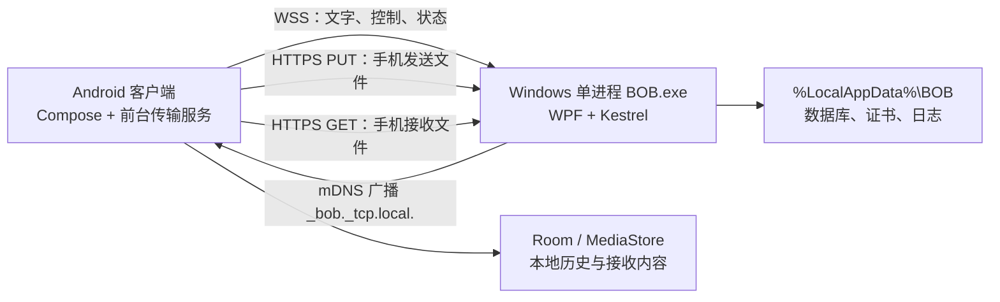

# BOB v1 产品与技术规格

## 文档职责

本文是 BOB 一期的产品范围、用户体验、技术边界、实施顺序与验收标准的唯一主规格。

- 线级消息、端点、状态机和错误码以 [传输协议契约](../../contracts/transport-v1.md) 为准。
- 长期架构取舍以 [ADR-0001](../../adr/0001-lan-topology-and-trust.md) 为准。
- 当前实施状态与阶段门槛以 [current.md](../../active/current.md) 为准。

## 1. 产品定义

BOB 是个人自用的 Android 与 Windows 局域网互传工具。双方处于同一 Wi-Fi 时，用户可在几步内双向发送文字、图片和普通文件；不经过云端。

### 目标用户与平台

- 单个用户的个人手机与个人电脑，不构建多人协作产品。
- Windows 10/11 x64。
- Android 14，`minSdk = 34`；不兼容老 Android 设备。
- Android 的 `compileSdk` 与 `targetSdk` 在开始实现时采用当时稳定版本，并在仓库中锁定。
- Android 使用原生 Kotlin、Jetpack Compose Material 3、ViewModel、StateFlow 与 Coroutines。
- Windows 使用 .NET 10 LTS、WPF + XAML、轻量 MVVM、Generic Host 与同进程 Kestrel。

### 一期非目标

- 互联网、公网穿透、云中继或云同步。
- 账号、配对码、设备授权列表、客户端身份认证。
- iOS、macOS、Linux、老版本 Android。
- 文件夹传输、自动打包 ZIP、断点续传、远程文件浏览。
- 自动剪贴板同步、链接识别、队列拖动排序。
- Windows Service、多进程、命令行主入口、开机自启。
- MSI/MSIX、Windows 代码签名、自动更新、Google Play 发布。
- 固定吞吐量承诺。

## 2. 系统拓扑



### 固定角色

- Windows 是唯一 HTTPS/WSS 服务端，Android 始终主动连接。
- 默认端口为 `42424`；所有业务流量只使用 TLS，不提供 HTTP/WS 回退。
- Windows 同时只维护一个 Android 活动会话；Android 同时只连接一台 Windows。
- 两方向文件传输可同时进行，但每个方向最多一个活动文件。
- Windows 未运行时 Android 无法连接；Android 未打开且无活动传输时不维持后台连接。

### 发现

- Windows 使用 mDNS 发布 `_bob._tcp.local.`。
- Android 使用 `NsdManager` 搜索。
- 发现一台时自动连接；发现多台时由用户选择；未发现时提供刷新和手动 IP。
- mDNS 只解决寻址，不作为可信身份来源。

## 3. 信任边界

BOB v1 只面向个人可信局域网，不以公共或恶意 Wi-Fi 为威胁模型。

- Windows 首次运行生成并持久保存自签名证书。
- Android 第一次连接某 Windows 实例时静默记录证书指纹；以后必须匹配。
- 证书指纹变化时阻止连接，并提供“重置信任”操作。
- 这叫“证书信任”，不是设备绑定；没有账号、验证码、令牌或客户端证书。
- Windows 自动接受当前活动客户端发送的内容。
- 初次静默 TOFU 无法抵御第一次连接时的中间人攻击，这是明确接受的边界。
- 实现不得安装全局 trust-all 证书验证器。

## 4. 功能需求

### FR-01 连接与状态

- 两端主界面持续显示“正在查找、等待手机、已连接、已断开、连接被阻止”之一。
- 显示当前对端名称。
- WSS 断开后，Android 在应用可见或活动传输期间尝试重连。
- Android 应用不可见且无活动传输时允许断开。

### FR-02 文字

- 双端都可输入、粘贴并发送非空纯文字。
- 文字绕过文件队列，经 WSS 发送。
- 接收方先按 ID 幂等持久化，再回执。
- 对端确认保存后显示“已送达”；v1 没有已读回执。
- 文字记录支持一键复制，不自动写入系统剪贴板或文本文件。

### FR-03 Android 发送

- 应用内支持选择一个或多个图片、一个或多个普通文件。
- 支持 Android 系统分享入口的单项与多项内容。
- 选择完成后直接发送或入队，不增加确认页面。
- 系统分享内容只保证当前前台会话内可用；v1 不为断开连接后的临时 `content://` URI 建持久副本。授权失效时标记失败并要求重新选择。

### FR-04 Windows 发送

- 支持拖入一个或多个文件或图片。
- 支持图片/文件选择器多选。
- 拖入文件夹时不入队，提示“v1 暂不支持文件夹，请先压缩为 ZIP”。
- Android 离线时，Windows 将待发文字和文件元数据持久化为“等待连接”。
- Windows 重启后继续保留队列；源文件被移动或删除时置为失败，错误码 `source_missing`，不偷偷复制整份文件。

### FR-05 自动接收与落点

- 接收端不弹接受/拒绝对话框。
- Windows 默认保存到 `Downloads\BOB`，设置页允许更改目录。
- Android 普通文件通过 MediaStore Downloads 发布到 `Download/BOB`。
- Android 图片通过 MediaStore Images 发布到 `Pictures/BOB`，可从系统相册看到。
- 同名文件追加 ` (1)`、` (2)`，绝不覆盖。
- 文件名只作 basename 使用，并执行协议规定的净化与路径越界检查。

### FR-06 队列与并发

- 手机→电脑和电脑→手机各有一个 FIFO 队列。
- 每方向最多一个活动文件；两方向可各传一个。
- 多选的每一项是独立传输，单项失败不阻塞后续项目。
- 可取消活动项、移除未开始项、重试失败项。
- 重试创建新传输 ID，并从第 0 字节开始；不复用旧临时文件。

### FR-07 流式传输与完整性

- 文件经 HTTPS 流式读写，不整体载入内存，不设置人为大小上限。
- 元数据 `size` 可为空，以兼容无法预先报告长度的 Android ContentProvider。
- 未知大小使用 chunked 传输并显示不确定进度；已知大小显示百分比。
- 收发双方在正文流中增量计算 SHA-256。
- Windows 文件系统接收端先写 `.bob-<transfer-id>.part`；Android 接收端先创建 `IS_PENDING = 1` 的 MediaStore 项。正文完成后等待 WSS 摘要。
- 摘要匹配后，Windows 以禁止覆盖的原子移动发布文件；Android 将 MediaStore 项切换为 `IS_PENDING = 0`。两者都保证未校验内容对用户不可见。
- 发送方收到完成回执并持久化后还要发送终态确认，才结束协议重放。
- 连接在正文完成与摘要确认之间断开时，临时文件和状态可短暂持久化，重连后继续摘要协调；这不是断点续传。
- 校验失败、取消或超时后删除 Windows 临时文件或 Android pending MediaStore 项。
- 断开导致当前正文失败时，从头重试。

### FR-08 进度与状态

文件卡片显示：

- 排队中、等待连接、传输中、校验中、完成、失败、已取消。
- 已传字节、总大小（若已知）、即时平滑速度和预计剩余时间（若可计算）。
- 失败原因以及是否可重试。

进度事件最多每秒 4 次；速度和 ETA 由界面根据字节采样推导。

### FR-09 历史

两端本地数据库长期保存且不自动过期：

- 类型、方向、时间与状态。
- 文字正文。
- 文件名、大小、本地路径与失败信息。
- 重试关系和校验结果。

数据库不复制已交付文件本体；缩略图是可清理缓存。清空历史删除用户可见的已终结记录、对应文字正文和缩略图，但不删除已经接收的文件，也不影响活动/离线队列。尚未确认的文字、digest 协调、终态投递状态及最小去重 tombstone 作为隐藏协议数据保留，完成确认后可缩减为不含文字正文的去重记录。

### FR-10 Android 锁屏与后台

- Android 只在已经存在活动传输时启动前台传输服务。
- 前台服务维持 WSS 与正在进行的 HTTPS 流，展示持续进度通知。
- 锁屏后活动传输必须继续完成。
- 无活动传输时不全天常驻；用户下次打开 App 后再发现并连接。
- 手机重启后不自动启动。

### FR-11 Windows 窗口与托盘

- `BOB.exe` 是 WPF GUI、Kestrel、发现服务和队列工作器的单一进程。
- 关闭主窗口只隐藏到系统托盘；托盘“退出 BOB”才停止服务。
- 托盘菜单包含打开、连接状态和退出。
- 不提供自动启动。
- 便携版优先使用可靠的托盘气泡通知；若未来验证出无需安装即可稳定激活的 Windows Toast，再替换通知实现。

### FR-12 通知

- 窗口/页面可见且活跃时只更新界面。
- Windows 隐藏或失焦时，在接收完成或失败后显示托盘通知；点击打开主窗口并尽量定位记录。
- Android 后台或锁屏时显示传输进度与完成/失败通知。
- 通知默认无声；失败项提供重试入口。

## 5. 核心用户流程

### 首次连接

1. 用户在 Windows 手动运行 `BOB.exe`。
2. 应用生成证书、启动 Kestrel、发布 mDNS，并按需触发 Windows 防火墙提示。
3. 用户打开 Android BOB。
4. Android 在仅发现一台电脑时自动连接，静默记录首次证书指纹。
5. 双端显示已连接，可立即发送。

没有登录、扫码、验证码、配对或接收确认。

### 手机发送到电脑

1. 用户在 BOB 内选文字/图片/文件，或从系统分享进入。
2. 内容立即发送；文件按选择顺序入队。
3. Windows 自动创建时间线记录与临时文件。
4. 正文流完成后校验 SHA-256，原子发布并更新双方状态。

### 电脑离线投递到手机

1. 用户在 Windows 输入文字、选择或拖入文件。
2. Android 不在线时，项目显示“等待连接”并持久化。
3. Android 下次打开、完成发现和会话快照后自动接收。
4. Android 按类型写入 Download/BOB 或 Pictures/BOB，并回执完成。

### 失败与重试

1. 断网、源文件消失、空间不足、权限或校验错误将记录置为失败。
2. 未发布临时对象不会作为完整文件暴露：Windows 的 `.part` 不改名，Android 的 pending MediaStore 项不设为可见。
3. 用户从原卡片重试；系统创建关联的新传输，从头发送。
4. 已完成的同批项目不会重复发送。

## 6. 页面与交互

### 共同主界面

两端保持同一信息结构：

1. 顶部：BOB 标识、连接状态、对端名称、设置入口。
2. 中部：按时间排列的双向文字、图片和文件卡片。
3. 底部：多行文字输入、图片、文件与发送按钮。
4. 设置作为独立页面或面板。

发送与接收通过卡片位置、方向标记和文字标签共同区分，不只依赖颜色。常规操作不使用模态弹窗。

### 空状态与拖放

- 空时间线保留大面积留白，中心显示一句引导和带深色描边的投放区。
- Windows 投放区接收文件；Android 对应区域引导选择内容。
- 一旦存在记录，投放能力仍可保留，但不遮挡时间线。

### 时间线卡片

- 文字：正文、时间、方向、送达状态、复制。
- 图片：缩略图、文件名、大小、状态、查看。
- 文件：名称、大小、进度、速度、ETA、取消/重试/打开。
- 错误就地展示，不另开错误详情弹窗。

### 设置

Windows：

- 接收目录、打开接收目录。
- 清空历史。
- 连接信息、应用版本。

Android：

- 重置证书信任。
- 查看固定接收位置。
- 清空历史。
- 应用版本。

## 7. 视觉系统

参考界面的“质感”解释为：整块纯色画布、强标题、大留白、深色描边、近直角控件与克制的实体按钮，不复制其暗色配色。

- 两端所有用户可见 UI 文案统一使用英文。
- Windows 与 Android 使用同一黑白像素手形图标；平台资产只允许增加安全边距、尺寸与蒙版适配，不改变主体造型。

### 色彩令牌

| 令牌 | 颜色 | 用途 |
| --- | --- | --- |
| `canvas` | `#CBA6F7` | 页面主背景 |
| `ink` | `#19141F` | 主文字、图标 |
| `muted-large` | `#5B4E65` | 等效至少 18 pt 常规或 14 pt 粗体的非关键大字 |
| `muted-small` | `#4B4054` | 普通字号次级文字 |
| `stroke` | `#32263B` | 边框、分隔与焦点 |
| `surface` | `#D8B7FA` | 时间线卡片浅层 |
| `button` | `#F7F1FC` | 实体按钮 |
| `button-ink` | `#19141F` | 按钮文字 |

`#5B4E65` 在主背景上的对比度约为 3.80:1，不足以承担普通字号正文，因此只保留给满足大文本阈值的非关键信息；新增的 `#4B4054` 约为 4.78:1，可承担普通字号次级文字。白色不作为浅紫背景上的正文色。

### 排版与几何

- Windows：Segoe UI；Android：系统 sans-serif。
- 页面主标题 700；正文 400–500。
- 8 px/dp 间距网格。
- 卡片、输入框与投放区使用 1–2 px/dp 深色描边。
- 圆角 0–4 px/dp；不使用药丸式控件。
- 不使用渐变、玻璃效果或装饰性阴影。
- 动画只服务于连接状态、进度与列表插入，短促且可被系统减少动态效果设置抑制。
- 焦点、悬停、按下、禁用状态必须有形状或描边差异。

## 8. 本地数据与目录

### Windows

- 程序以 x64 self-contained 便携目录/ZIP 交付。
- 用户数据固定在 `%LocalAppData%\BOB`，不放在程序目录。
- 子目录至少包含数据库、证书/身份、日志、临时文件与缩略图缓存。
- 默认收件目录为当前用户 `Downloads\BOB`。
- 证书私钥使用当前 Windows 用户的 DPAPI 保护。

### Android

- Room 保存历史和队列状态。
- 应用私有目录保存证书 pin、日志和临时状态。
- 图片通过 MediaStore Images 写入 `Pictures/BOB`。
- 普通文件通过 MediaStore Downloads 写入 `Download/BOB`。
- 接收时保持 `IS_PENDING = 1`；SHA-256 验证成功后才设置为 0，失败或取消则删除该 MediaStore 行。
- 不申请“所有文件访问”权限。
- Release APK 使用固定且离线备份的签名密钥；升级递增 versionCode。

### 日志

日志不得写入：

- 文字正文。
- 文件内容。
- 证书私钥。
- 完整用户文件路径；诊断信息需要路径时应尽量脱敏。

## 9. 建议代码边界

一期保持 Android 单 `app` module、Windows 单生产项目；不先拆 class library。

```text
src/
  windows/Bob.Windows/
    UI/ Application/ Domain/ Transport/
    Discovery/ Persistence/ Storage/ Security/ Platform/
  android/app/src/main/
    ui/ application/ domain/ network/
    discovery/ transfer/ persistence/ storage/ background/ platform/
tests/
  contract-fixtures/
  windows/
```

边界规则：

- UI 不直接访问数据库、HTTP DTO 或文件流。
- Domain 只表达传输实体、状态转换和不变量。
- Application 协调发送、接收、取消、重试和恢复用例。
- Transport/Network 实现 WSS、HTTPS、序列化与错误映射。
- Storage 负责安全命名、Windows `.part` / Android pending MediaStore、哈希、发布和空间错误。
- Persistence 负责事务、迁移与幂等记录。
- Platform 包含托盘、通知、分享 Intent、ContentResolver 和 MediaStore 适配。

## 10. 实施阶段

### P0 风险穿刺

只验证三个高风险点：

- Android 14 真机通过 NSD 发现 Windows。
- Android 以严格限定的 TOFU 校验连接 Kestrel 自签名 HTTPS/WSS。
- 一个大文件以单次流式读取双向传输、SHA-256 一致，内存不随文件线性增长。

退出门槛：错误 pin 必须失败；不能依赖 trust-all；换 IP 后可再次发现。

### P1 连接骨架与文字

- 创建 WPF/托盘/Generic Host/Kestrel 和 Android Compose 骨架。
- 建立 mDNS、WSS 会话、版本协商、单活动会话。
- 建立两端数据库迁移与统一时间线。
- 完成双向文字、ack、断线重发和 Windows 离线排队。

退出门槛：重启双方后历史存在；文字在线双向与离线补发均通过。

### P2 Android → Windows 文件

- 应用内选择、系统分享、ContentResolver 流。
- HTTPS PUT、进度、取消、SHA-256、`.part`、原子发布。
- Windows 拖放空状态、时间线和托盘通知。

退出门槛：多选、零字节、中文/Emoji/同名文件、1 GB 文件和中途断网通过。

### P3 Windows → Android 文件

- Windows 拖放和选择器、持久 outbox。
- Android HTTPS GET、Download/MediaStore 落地。
- Android 前台传输服务与锁屏通知。

退出门槛：Android 离线后重新打开自动接收；锁屏传输完成；权限/空间失败不产生假文件。

### P4 可靠性与体验

- 100 文件 FIFO、双向同时传输、取消/移除/重试。
- 进度平滑、速度、ETA、失败信息与通知。
- 历史清理、缩略图缓存清理、重启恢复和竞态测试。
- 视觉令牌、键盘焦点、TalkBack/自动化可访问性标签。

退出门槛：协议状态机、幂等与故障注入测试通过；所有一期验收场景完成。

### P5 发布

- Windows `win-x64` self-contained 便携 ZIP。
- 固定签名的 Android Release APK。
- 从零安装、覆盖升级、数据保留、防火墙说明与签名密钥备份演练。

退出门槛：在干净 Windows 10/11 与 Android 14 真机上按 README 完成双向传输。

## 11. 一期验收

### 安装与连接

- Windows 目标机未安装 .NET 时，便携版可解压运行。
- 签名 Release APK 可侧载安装并使用同一签名覆盖升级。
- 同一正常家庭 Wi-Fi 中，Windows 启动后 Android 通常 5 秒内发现并连接。
- 一台自动连接、多台可选、mDNS 失败可手动 IP。
- 证书变化不会被静默接受。

### 功能与体验

- 文字、图片、普通文件均可双向发送。
- 正常局域网中，文字通常 1 秒内出现在对端时间线。
- Android 系统分享支持单项与多项；Windows 支持拖放和多选。
- 接收无需确认；同名不覆盖；Android 图片在系统相册可见。
- 状态、进度、速度、ETA、取消、移除和重试均可操作。
- 两端重启后历史仍存在；清空历史不删除已接收文件。

### 可靠性

- 完成至少一次每方向的单个 1 GB 文件实机测试。
- 完成至少一次 100 文件队列测试。
- 至少一次两方向同时传输测试。
- 最终接收文件 SHA-256 与发送源一致。
- 大文件传输的内存占用不随文件大小线性增长。
- 手机锁屏后，已开始的传输继续完成。
- 断网或任一进程退出后，不产生可被误认为完整文件的结果。
- 当前文件失败可从头重试，其他已完成项目不受影响。

不设置固定传输速度门槛，因为结果受 Wi-Fi、路由器与设备存储性能影响。

## 12. 依赖门槛

平台与框架方向已经确定；当前文档不批准具体 artifact、版本或可选第三方包。实现前按最小依赖原则评估：

- Android 已定 Kotlin、Compose、Coroutines、ViewModel/StateFlow、Room 与平台 `NsdManager`；网络客户端、JSON 序列化及所有具体 artifact/version 在实现阶段锁定。
- Windows 已定 .NET 10 LTS、WPF、Generic Host 与 Kestrel；SQLite provider 的具体包和版本在实现阶段锁定。
- Windows mDNS 优先做原生 DNS-SD 风险验证；只有原生方案不能满足实机兼容性时，再提出具体依赖与理由。
- Windows 托盘优先使用框架可用的 `NotifyIcon` 方案，不引入大型 UI 框架。

新增依赖前需记录：解决的真实平台缺口、许可证、维护状态、包体影响及替代方案。

## 13. 主要风险

| 风险 | 一期处理 |
| --- | --- |
| 静默 TOFU 的首次 MITM | 明确限定可信个人 Wi-Fi；后续严格 pin；提供重置信任 |
| mDNS 被路由器/防火墙阻断 | 手动 IP；P0 真机和多网卡验证；首次防火墙提示 |
| 自签名证书校验误写为 trust-all | 独立安全组件和错误 pin 测试 |
| ContentProvider 不给长度 | `size = null` + chunked；不预拷贝大文件 |
| 分享 URI 在等待时失效 | v1 只保证当前前台会话；失败后重新选择 |
| HTTP 与 WSS 完成/取消竞态 | 契约状态机、幂等 ID、原子发布后 completed 优先 |
| Windows 离线队列源文件被移动 | 持久路径与元数据；发送前复核并标记 source_missing |
| Android 后台限制 | 只在活动传输时启用前台服务；真机锁屏/Doze 测试 |
| 便携程序的 Windows Toast 激活不可靠 | v1 使用托盘气泡，避免安装注册依赖 |
| 大文件磁盘/内存压力 | 流式 I/O、Int64、空间错误、临时文件和哈希测试 |

## 14. 交付前仍需完成

这份规格确认行为边界，但开始编码后还必须补齐：

- 仓库真实构建、测试、运行与打包命令。
- 所选依赖及锁定版本。
- C# 与 Kotlin 共用的协议 JSON golden fixtures。
- 数据库 schema 与迁移策略。
- P0 风险验证记录和设备/网络测试矩阵。
